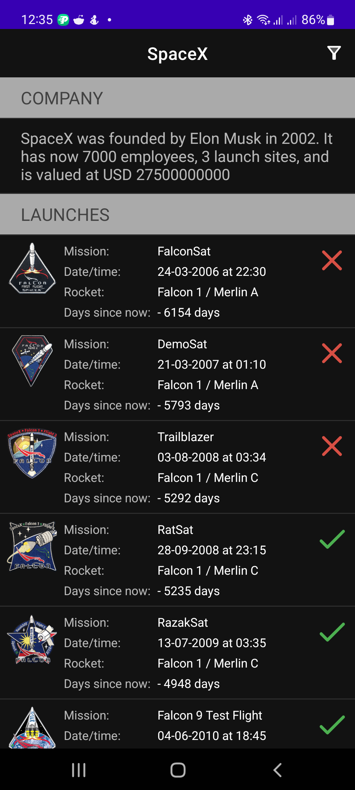
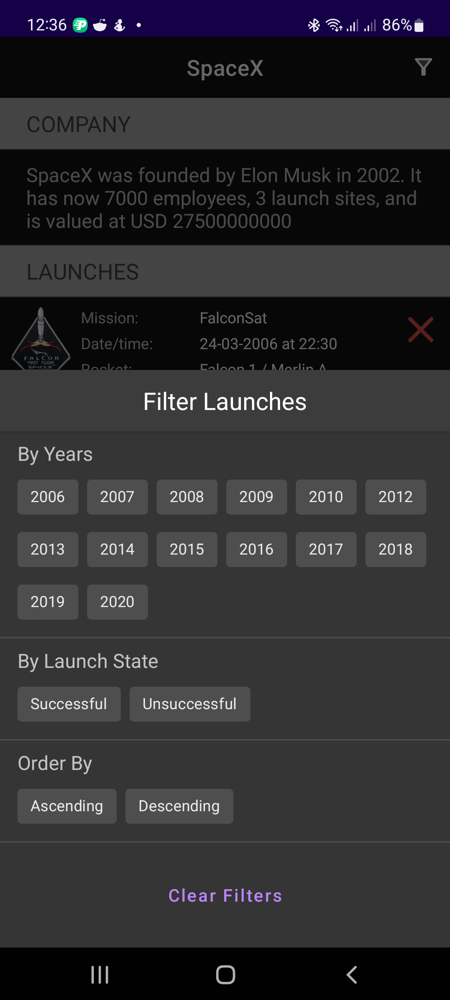
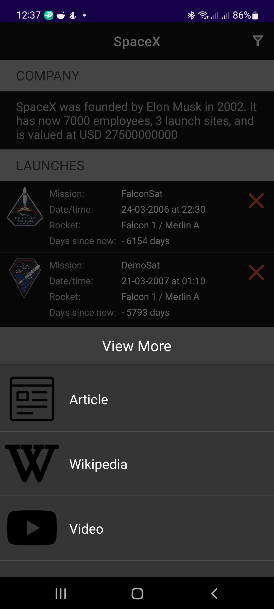
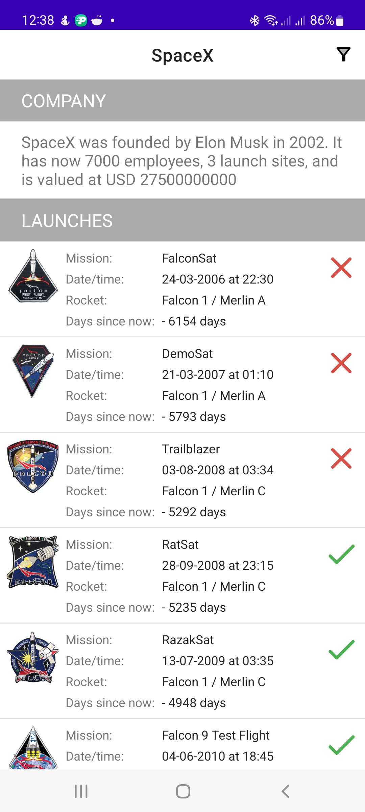
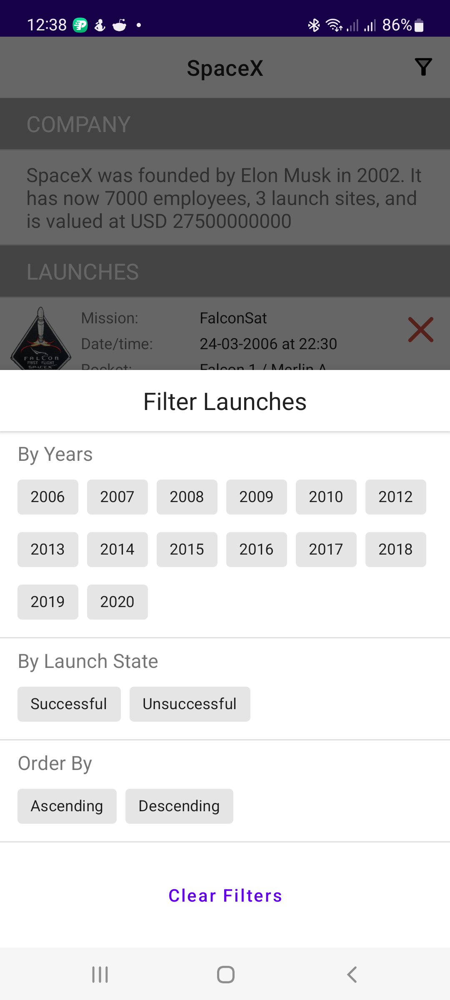
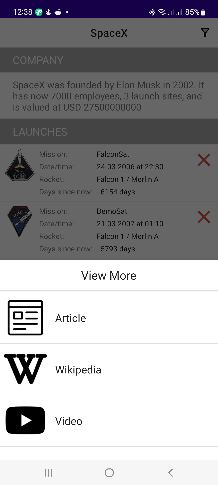

# SpaceX

An android application displaying lists of Space X launches and also information about the founder of Space X.

## Tools and Libraries
* Clean architecture
* MVVM with repository pattern
* Retrofit
* Coroutine
* Room database
* Glide
* Timber

## Screenshots
<ul>
  
  
  
  
  
  
</ul>

## Author

* [Segun Francis](https://www.linkedin.com/in/segun-francis-302361a1)

## License

      Copyright 2023 Segun Francis

      Licensed under the Apache License, Version 2.0 (the "License");
      you may not use this file except in compliance with the License.
      You may obtain a copy of the License at

        http://www.apache.org/licenses/LICENSE-2.0

      Unless required by applicable law or agreed to in writing, software
      distributed under the License is distributed on an "AS IS" BASIS,
      WITHOUT WARRANTIES OR CONDITIONS OF ANY KIND, either express or implied.
      See the License for the specific language governing permissions and
      limitations under the License.